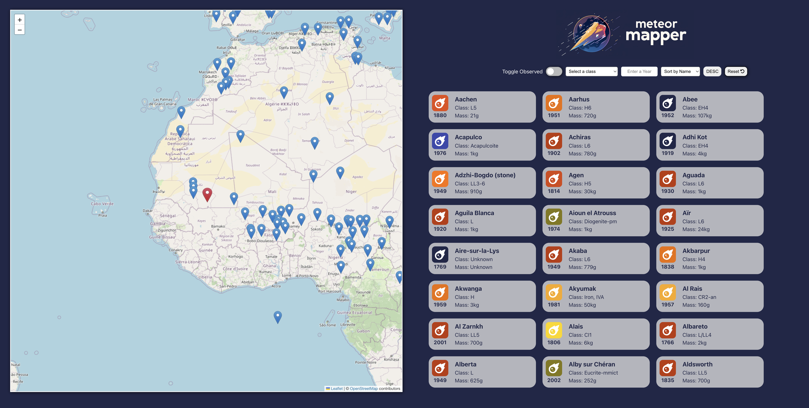

# Meteor Mapper

Meteor Mapper is an online data visualization tool built in React, utilizing NASA's API to showcase recorded meteorite landings worldwide.

## Features

- **Mapping**: Utilizes React Leaflet for interactive mapping.
- **Filters**: Enables filtering by meteorite class and observed fall.
- **Sorting**: Provides options to sort meteorites by name, year, class, and mass.
- **Reset**: Allows resetting filters and sorting options to default.
- **Loading Indicator**: Displays a spinner during data loading.
- **Error Handling**: Logs errors if data retrieval fails.

## Technologies Used

- React with Vite
- React Leaflet
- Axios

## Installation

To run the application locally, follow these steps:

1. Clone the repository.
2. Install dependencies using `npm install`.
3. Start the development server with `npm start`.

## Usage

1. **Toggle Observed**: Toggle between observed and fell meteors.
2. **Filter by Class**: Select a specific meteorite class to filter results.
3. **Filter by Year**: Filter meteorites by the year of observation.
4. **Sorting**: Choose sorting criteria from the dropdown menu.
5. **Reset**: Reset all filters and sorting to their default state.

## Components

### List Component

The `List` component manages the list view of meteorite data. It includes:
- Filters for class, year, and observed fall.
- Sorting options for name, year, class, and mass.

### Map Component

The `Map` component displays meteorite landings on an interactive map using React Leaflet. It includes:
- Custom markers for observed and fell meteors.
- Popup details for each meteorite.

## Development Notes

Meteor Mapper was developed collaboratively during a software development bootcamp using pair programming techniques. It integrates multiple React components to achieve seamless data visualization and interaction.

---

Feel free to explore and contribute to enhance Meteor Mapper!
